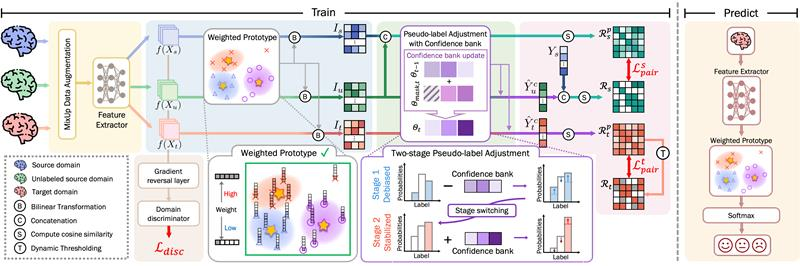

# [ICASSP 2026] Confidence-Aware Adaptive Semi-Supervised Approach for Reliable EEG-Based Emotion Recognition
Official implementation of  _Songha Kim, Soyeon Bak, Jun-Mo Kim, Woohyeok Choi, Yebin Choi and Tae-Eui Kam_, "Confidence-Aware Adaptive Semi-Supervised Approach for Reliable EEG-Based Emotion Recognition", 2026 IEEE International Conference on Acoustics, Speech, and Signal Processing (ICASSP), Barcelona, Spain, May 4-8, 2026.

  

## 💘 Acknowledgements
* The implementation code is bulit on the [EEGMatch](https://github.com/KAZABANA/EEGMatch) code base 
* This work was supported by the Institute of Information and Communications Technology Planning and Evaluation (IITP) grant funded by the Korea government (MSIT) under the Artificial Intelligence Graduate School Program at Korea University (No. RS-2019-II190079), the Artificial Intelligence Research Hub Project (No. RS-2024-00457882), and Development of AI Autonomy and Knowledge Enhancement for AI Agent Collaboration (No. 2022-0-00871). This work was also supported by the National Research Foundation of Korea (NRF) grant funded by the Korea government (MSIT) (No.RS-2023-00212498)
